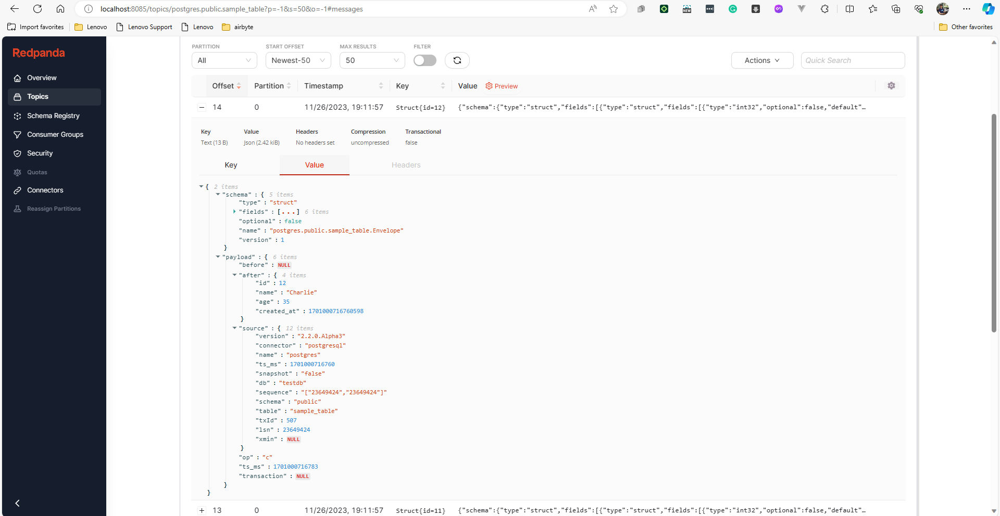
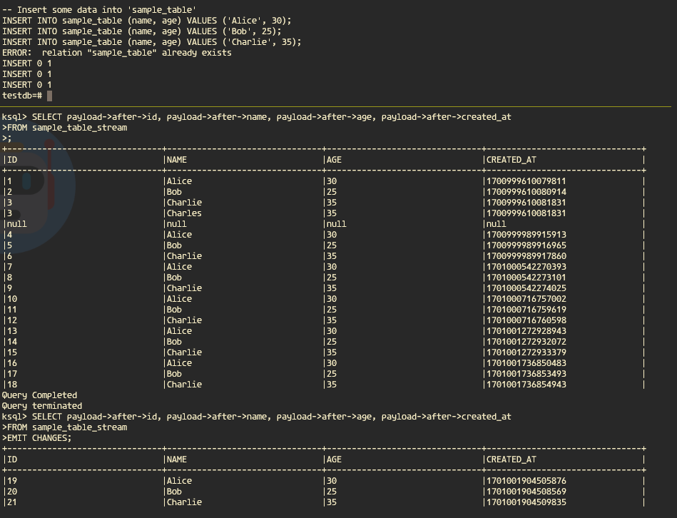

# Set postgre wal_level to logical

We need to set postgre wal_level to `logical` to make debezium works

```bash
docker exec -it  postgres bash
psql -U user -d testdb
```

```sql
-- Try to check wal_level
SHOW wal_level;

-- if wal_level is not logical, perform this
ALTER SYSTEM SET wal_level = 'logical';
select pg_reload_conf();
```

If `wal_level` is `replica` instead of `logical`, try to restart docker-compose:

```bash
docker compose stop
docker compose start
```

# Set debezium

```bash
curl -X POST -H "Content-Type: application/json" --data '{
    "name": "postgres-connector",
    "config": {
        "connector.class": "io.debezium.connector.postgresql.PostgresConnector",
        "database.hostname": "postgres",
        "database.port": "5432",
        "database.user": "user",
        "database.password": "password",
        "database.dbname" : "testdb",
        "database.server.name": "dbserver1",
        "table.whitelist": "public.your_table",
        "plugin.name": "pgoutput",
        "topic.prefix": "postgres",
        "key.converter": "org.apache.kafka.connect.storage.StringConverter",
        "value.converter": "org.apache.kafka.connect.json.JsonConverter",
        "value.converter.schemas.enable": "true"
    }
}' http://localhost:8083/connectors
```

# Insert data to postgre

```bash
docker exec -it  postgres bash
psql -U user -d testdb
```

```sql
-- Create a new table named 'sample_table'
CREATE TABLE sample_table (
    id SERIAL PRIMARY KEY,
    name VARCHAR(100),
    age INT,
    created_at TIMESTAMP DEFAULT CURRENT_TIMESTAMP
);

-- Insert some data into 'sample_table'
INSERT INTO sample_table (name, age) VALUES ('Alice', 30);
INSERT INTO sample_table (name, age) VALUES ('Bob', 25);
INSERT INTO sample_table (name, age) VALUES ('Charlie', 35);
UPDATE sample_table SET name='Charles' WHERE id=3;
DELETE FROM sample_table WHERE id=3;
```

Check out `http://localhost:8085` and see the topics. There will be a topic named `postgres.public.sample_table`



# KSQL

```bash
docker exec -it  ksqldb-cli bash
```

Then run the following:

```bash
ksql http://ksqldb-server:8088
```

Create stream, notice that we need to to create a structure that match or kafka topic value.

```sql
CREATE STREAM sample_table_stream (
    payload STRUCT<
        before STRUCT<
            id INT,
            name VARCHAR(100),
            age INT,
            created_at BIGINT
        >,
        after STRUCT<
            id INT,
            name VARCHAR(100),
            age INT,
            created_at BIGINT
        >
    >
) WITH (
    KAFKA_TOPIC = 'postgres.public.sample_table',
    VALUE_FORMAT = 'JSON'
);
```

Try to show all data.

```sql
SELECT payload->after->id, payload->after->name, payload->after->age, payload->after->created_at
FROM sample_table_stream 
```

Or only the latest changes

```sql
SELECT payload->after->id, payload->after->name, payload->after->age, payload->after->created_at
FROM sample_table_stream 
EMIT CHANGES;
```

